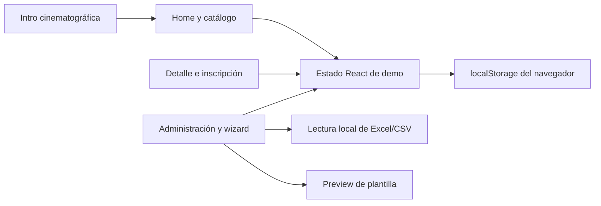
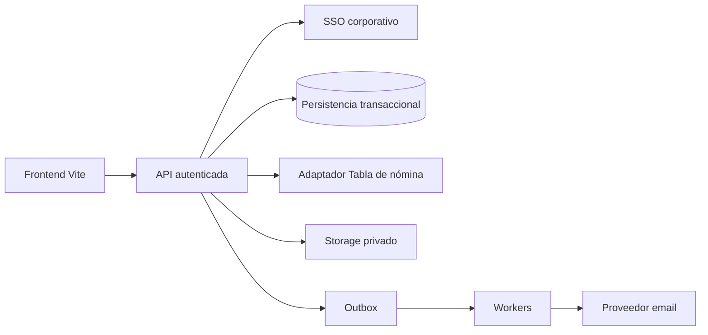

# Arquitectura del prototipo

Supernova Eventos es una micro-app de frontend construida con Vite, React y TypeScript. Demuestra el recorrido de un colaborador y la creación administrativa de eventos. **No hay backend, SSO ni envío real de emails.**

## Límites actuales

Los eventos e inscripciones del prototipo se resuelven en el navegador con datos sintéticos. El helper `src/lib/storage.ts` lee/escribe `localStorage` de forma defensiva; el estado es local al origen y navegador. No hay sincronización entre personas, control de cupo concurrente ni fuente corporativa de identidad. La vista administrativa sirve para explorar la demo y no representa una autorización real.

`src/types.ts` define las estructuras del mock: `EventItem`, `Registration`, `AudiencePerson` y `EmailTemplate`. La selección de nómina es ficticia. Un archivo leído en el navegador sirve para visualizar una audiencia, no para dar acceso corporativo. La plantilla de email es una vista previa, no una entrega a sus destinatarios.

## Composición

Home, Mis eventos, Favoritos y administración comparten un header centrado que cambia de barra a cápsula flotante al bajar. El creador reemplaza ese shell por una barra de pasos con volver a la izquierda. Inscripción y pase usan un `dialog` nativo fullscreen y ocultan header y footer; se cierran con X o Escape y restauran el foco. El pase incluye un calendario mensual custom de presentación, con la fecha del evento resaltada, sin alterar la reserva.

La intro se monta en cada refresh y puede repetirse desde el footer. Su timeline dura 3,4 segundos, no tiene botón «Saltar intro» y conserva Escape y movimiento reducido. GSAP se carga en su chunk lazy. El planeta pausa sus animaciones mientras la intro vuelve inerte el contenido, cuando queda fuera de pantalla y cuando se oculta la pestaña.

`index.html` presenta el primer frame orbital con CSS crítico antes de descargar React. `IntroLoading` comparte el artwork con `CinematicIntro` y sustituye el antiguo fallback de solo logo; un reloj común conserva el avance al entregar la escena a GSAP. App retira el bootstrap y sus estilos después del primer commit. El snippet de `src/features/intro/bootstrap.html` documenta la composición inicial que debe mantenerse en sincronía con `index.html`.

`useTheme` controla la preferencia `dark | light`, persistida en `supernova-theme-v1`. Un script inicial aplica esa preferencia a `html[data-theme]` antes del primer paint; sin una elección válida el valor es oscuro, sin depender del sistema operativo. El hook actualiza también `color-scheme` y `theme-color`. `theme.css` concentra los tokens y vistas compartidas; los temas de controles, registro y administración adaptan sus componentes específicos. `scrollbars.css` personaliza el documento y los contenedores internos con colores del mismo tema. La invitación de email conserva sus colores de diseño.

Favoritos guarda identificadores locales, permite buscar y quitar eventos, y aplica los mismos filtros de visibilidad que el catálogo. Perfil y notificaciones usan popovers nativos compactos. `src/layout.css` concentra la composición compacta, el header y los ajustes responsive sobre los estilos base.

El catálogo muestra **tres eventos en total por página**, con la jerarquía **Eventos activos → Eventos próximos → Eventos finalizados**. Activo significa que empezó y todavía no terminó; próximo, que aún no empezó; finalizado, que su fecha de fin ya llegó o su estado persistido es `ended`. Los borradores y los privados sin acceso se excluyen. Los grupos sin tarjetas en la página actual no ocupan espacio; su contador muestra el total del grupo dentro de los resultados filtrados.

Búsqueda, categorías, modalidad, favoritos y fecha se aplican antes de ordenar y paginar. El orden elegido rige dentro de cada grupo y conserva la prioridad de las fases. Cambiar filtros u orden vuelve a la primera página; al reducirse los resultados se ajusta la página a la última disponible. El paginado anuncia el intervalo mostrado, admite teclado y lleva el foco al comienzo de los resultados, por debajo del header. Los finalizados permiten consultar detalles, con la inscripción cerrada y sin mensajes de cupos restantes.

`getEventPhase` clasifica los eventos sin modificar su estado guardado y `useEventClock` actualiza la home al cruzar el inicio o fin de un evento y al volver a la pestaña. Esto usa el reloj del navegador para la demo. En la integración real, el backend debe determinar las fases y la disponibilidad; el contrato deberá conservar la prioridad y el límite global de tres resultados por página.

En móvil la navegación principal y Administración se ubican en una barra inferior. La cápsula de desktop solo anima su superficie, manteniendo constante la geometría del logo. Mi perfil agrupa identidad y preferencias; Cerrar sesión modifica únicamente un estado persistido de la demo, que debe reemplazarse por el logout corporativo al integrar SSO.

Los selects, calendarios, horas y colores usan controles propios con popovers nativos. La inscripción valida con tostadas de Supernova, sin mensajes de validación del navegador. Administración mantiene filtros editados y aplicados por separado; Buscar actualiza métricas y tabla, los tags abren un diálogo para quitar filtros y el paginado muestra cinco o diez filas. Nuevos eventos no tienen TyC hasta activar su toggle e ingresar condiciones.

El stack visual usa CSS, Motion y GSAP; iconos Lucide y tipografías locales. Animar transform/opacity y respetar `prefers-reduced-motion` preserva fluidez y accesibilidad. Las operaciones de negocio no deben depender de que una animación finalice.

## Agentes del repositorio

Los agentes frontend y trailer se mantienen separados dentro de `agents/frontend/` y `agents/trailer/`. Sus instrucciones apuntan a herramientas y archivos del proyecto, respetan ownership y pueden usarse desde Codex. Las referencias de frontend en `agents/frontend/skills/` ayudan a arquitectura, integración, revisión y polish. Las carpetas originales `codex/` y `trailer-arquitect-claude-code/` se conservan como referencia; no son la autoridad del contrato backend. Ver [agents/README.md](../agents/README.md).

## Integración futura propuesta

Este diagrama es una propuesta, no infraestructura existente. La API verifica identidad, rol, compañía, audiencia y plazas; el cliente presenta resultados. Un adapter debe separar DTOs públicos del detalle administrativo: nunca devolver emails o listas de invitados con las tarjetas del catálogo.

El primer slice de integración debería incluir sesión, catálogo visible, detalle, inscripción transaccional/cancelación y borradores administrativos. Imports y campañas se conectan después con validación en servidor y seguimiento de jobs. Lista de espera, campañas programadas y check-in real son ampliaciones que requieren contrato y pruebas específicas.

El prompt completo, modelos propuestos, endpoints, errores, políticas de email, criterios de pruebas y pasos de conexión frontend están en [backend-prompt.md](backend-prompt.md). Todos deben validarse con los responsables de los sistemas corporativos antes de integrarlos.
